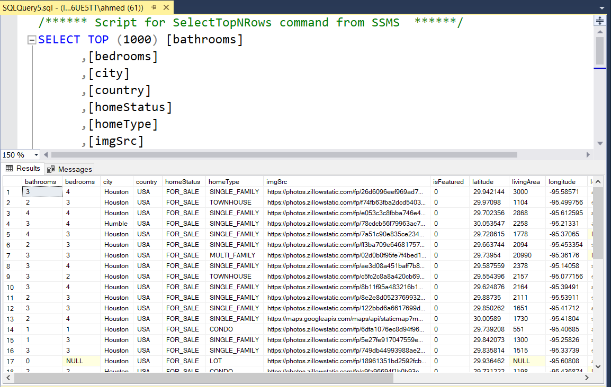

# Extracting API data and load to MS Server 


### Overview

This project extracts real estate data from an API  , transform and loads it into a SQL Server database. The goal is to create a historical data about listings and properties  for analysis and reporting.


### Features 

- Extracts data from a RESTful API in JSON format . 
- Process and normalize json to extract nested data and convert into tabluar format and remove unnessssary columns and change data formats .
- Loads the extracted data into a SQL Server database.


### Technolgies & Tools used

* Python
* SqlServer
* Pandas 
* sqlalchemy
* pyodbc
	


### Usage
Run the ETL process using the following command:
```bash
python Script.py
```


### Screenshot



